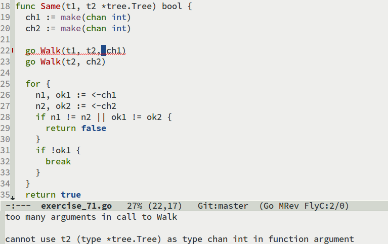

最近心血來潮，花了幾天的時間[把 A Tour of Go 的練習題做完了](https://github.com/rangilin/go-tour-exercises)。主要開發的環境是 Emacs，因此這次想要分享一些研究時發現的資料，希望能給其他有需要的人一點幫助。標題下的 Simple 一詞是因為我的設定並無考慮到比較複雜的開發環境需要，目的僅是為了能在 Emacs 寫 Go。

## go-mode ##

Go 的社群裡有許多人幫各種開發工具寫了官方的 plugin，Emacs 當然也不例外。`go-mode` 是 [Go 官方的 major mode](http://golang.org/misc/emacs/)，裡面除了基本的語法上色外，還整合了一些 Go 的官方工具，簡單好上手。Go 所發佈的檔案裡，就有直接附上了這些檔案。假設安裝在 `/usr/local/go`，那麼 `go-mode` 的檔案位置就在 `/usr/local/go/misc/emacs`。

```
(add-to-list 'load-path "/usr/local/go/misc/emacs/go-mode-load.el" t)
(require 'go-mode-load)
```

這樣子設定，Emacs 只要開啟 go 檔案就會進入 `go-mode` 了。

除了官方的檔案之外，Emacs 的 Package Archive 像 [Marmalade](http://marmalade-repo.org/packages/go-mode) 或 [Melpa](http://melpa.milkbox.net/#/go-mode) 也都提供安裝 `go-mode` 的檔案。這些地方的更新會比等 Go 新版本發佈的檔案來的快，因此我個人是從 Melpa 安裝的。

### godef ###

`go-mode` 目前有一個外部的 dependency : [godef](http://godoc.org/code.google.com/p/rog-go/exp/cmd/godef)，主要是為了顯示 Document，還有方便直接找尋 Go 的 source code。安裝的方式是使用 go command 。

```
go get code.google.com/p/rog-go/exp/cmd/godef
```

### Features ###

這邊簡單的介紹一些 `go-mode` 的功能 :

 - `c-c c-a` : `go-import-add`，自動 import 所選擇的 package，裡面列出 Go 預設和 workspace 內有的 package。
 - `go-remove-unused-imports` : 移除無用的 import。
 - `c-c c-j` : `godef-jump`，自動跳到游標所在位置程式的原始碼。
 - `c-c c-d` : `godef-describe`，在 minibuffer 顯示該程式碼的宣告。

### gofmt ###

Go 解決 convention 問題的方式是寫了一個 [gofmt](golang.org/cmd/gofmt/) 工具來做自動排版，並建議大家都用它。因此當然也需要將它納入環境中。目前最常見的方式是讓 `gofmt` 在儲存時自動執行。

```
(add-hook 'before-save-hook 'gofmt-before-save)
```

此外，由於 Go 是建議使用 tab 字元縮排，因此記得在 `go-mode-hook` 裡設定 `indent-tabs-mode`。

## flycheck ##

[Flycheck](http://flycheck.readthedocs.org/en/latest/) 是 Emacs 即時語法檢查的 plugin 之一，它[也有支援 Go](http://flycheck.readthedocs.org/en/latest/manual/languages.html#go)。並且使用像 `gofmt`，`golint`等工具做為檢查的依據，非常推薦。



## GOROOT, GOPATH in terminal ##

由於我習慣在 Emacs 內使用 terminal，因此同樣地也希望我能在 `term-mode` 下正常讀取 GO 的環境變數。

由於 `GOPATH` 需要指向 Go 的 [Workspace](http://golang.org/doc/code.html#Workspaces)，以方便開發和使用官方的 [go command](http://golang.org/cmd/go/)。但就我所知，目前官方並沒有方便獨立各個開發環境的方案；而[一堆人寫自己的 goenv file](https://www.google.com.tw/search?q=goenv)和較複雜的 [GVM](https://github.com/moovweb/gvm) 都讓我不知道如何是好。反正只是為了寫練習題，就**先暫時不解決這問題**，一律使用同一個 workspace。

而將環境參數帶入 terminal 的方式，我個人是使用 [exec-path-from-shell](https://github.com/purcell/exec-path-from-shell) 來將環境參數自動帶到 `term-mode`、`shell-mode`、`eshell-mode`。

```
(setq-default exec-path-from-shell-variables '("PATH" "MANPATH" "GOROOT" "GOPATH"))
(exec-path-from-shell-initialize)
```

## Conclusion ##

到這邊為止，就是我主要的 Go 開發環境。雖然只有很基本的東西，不過已經足夠滿足我寫完練習題的需求。其他像是用 [gocode](https://github.com/nsf/gocode) 做自動完成；使用 [YASnippet](https://github.com/capitaomorte/yasnippet) 設定常用的 snippets；使用 [go-eldoc](https://github.com/syohex/emacs-go-eldoc) 讓 eldoc 也能顯示 go 的宣告... 等等。這些都是可以進一步再去加強的地方。

希望這篇介紹可以讓需要的人對 Emacs 裡 Go 的開發環境有初步的認識。
