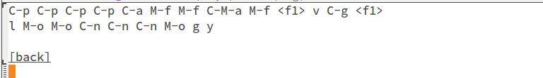

## view-lossage ##

Emacs 的 `view-lossage` 功能，基本上是一個內建的 key logger，它會紀錄並顯示最近 300 次按鍵紀錄。這個功能多半被使用者拿來在錄製影片、或是被人問到功能怎麼用的時候，顯示當下的按鍵紀錄給人看。



但在 Emacs 裡面使用 terminal，如果使用者輸入如 root、SSH 的驗證資訊時，會不會不小心就把密碼洩露出去了呢 ? 當然，Emacs 的 `shell-mode`、 `eshell-mode` 功能也做好了對應，在詢問密碼時會額外透過另一個 minibuffer 輸入，`view-lossage` 是不會紀錄下任何資訊的。

## Problem ##

但是在 `term-mode` 裡，Emacs 僅是做為一個溝通的橋粱：把使用者輸出的按鍵送給真的 terminal process，再將結果傳回來。這個中間並沒有任何額外的處理，在這種狀況下 `view-lossage` 就會將這些資訊完整地紀錄了下來，像這樣 :

```
C-c t s u d o SPC a p t - g e t SPC u p d a t e <return> s e c r e t - p a s s w o r d <return>
```

<script src="https://gist.github.com/be646e6aa85c4e3333b0.js?file=view-lossage" type="text/javascript">
</script>

[這個問題曾經有 Emacs 的使用者提出來過](http://aurellem.org/thoughts/html/emacs-password.html)，我也曾經[在 StackOverflow 上詢問過解決的方式](http://stackoverflow.com/questions/20748744/is-it-possible-to-disable-view-lossage)。但 `view-lossage` 這個函式是來自於 Emacs 的 C 原始碼，加上 `term-mode` 天生的限制，在不修改原始碼的狀況下能做的事情有限。

不過老實講這個問題也沒有那麼嚴重，最容易出現的狀況可能反而是自己不小心把有紀錄密碼的 `view-lossage` 訊息秀給人看而已。

## My workaround ##

由於我使用 `term-mode` 的次數頗頻繁，也很常透過 SSH 連到其他 server 上，再加上我幾乎沒有在用這個功能。因此我找出了一個方式能讓 `view-lossage` 比較不容易顯示出重要資訊。

```elisp
(defadvice term-send-raw (after clear-recorded-key activate)
  (if (string= (kbd "RET") (this-command-keys))
    (clear-this-command-keys)))
```

上面這段程式是對 `term-mode` 送出按鍵資訊的函式加了一個 after advice : 如果按下的鍵是 Enter 時，就會順便清除 `view-lossage` 的內容。

如此一來，輸入完密碼按下 Enter 後就會在當下清除紀錄。雖然是治標不治本，但至少解決了我的困擾。
